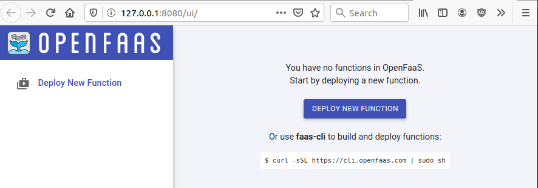
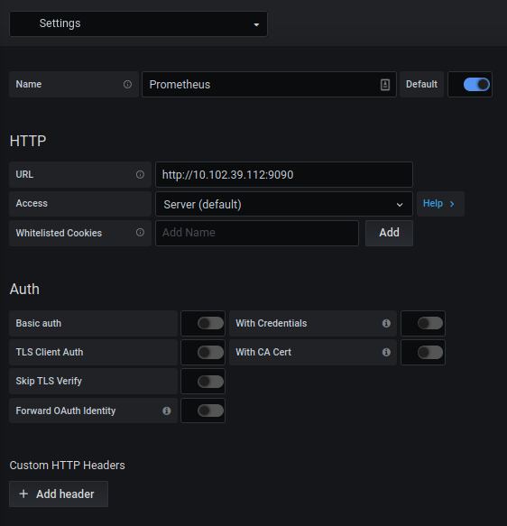
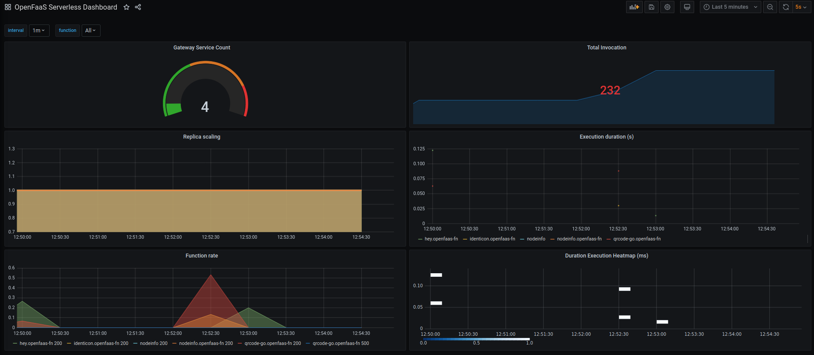
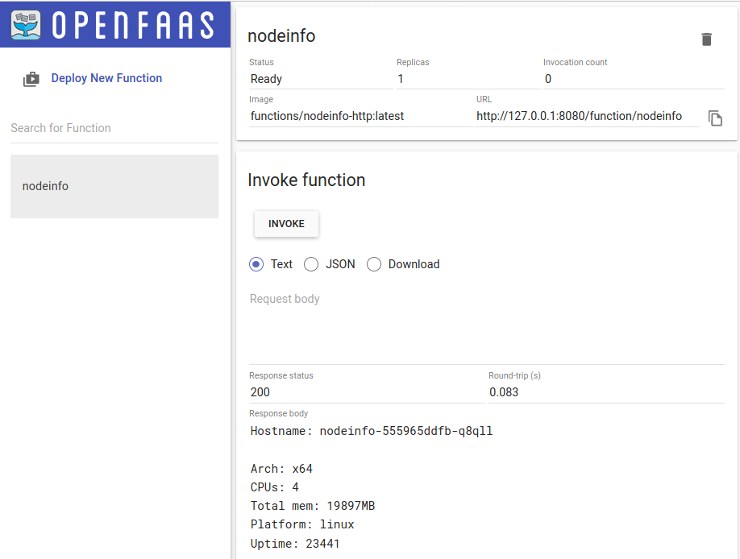
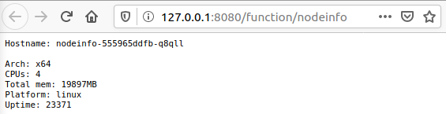

- [openfaas-http-echo](#openfaas-http-echo)
- [Prerequisites](#prerequisites)
  - [Install OpenFaaS](#install-openfaas)
  - [OpenFaaS Installation on Kubernetes](#openfaas-installation-on-kubernetes)
  - [Access the OpenFaaS Infra](#access-the-openfaas-infra)
  - [Deploy Grafana for Function Metrics](#deploy-grafana-for-function-metrics)
- [Deploy Sample Functions to OpenFaaS](#deploy-sample-functions-to-openfaas)
- [Deploy the GoLang based HTTP Echo Function](#deploy-the-golang-based-http-echo-function)
- [References](#references)
- [Maintainer](#maintainer)

# openfaas-http-echo

Sample OpenFaaS App on K8s which Reflects/Echo's the HTTP Data based on GoLang for Testing

# Prerequisites

* Working Kubernetes 1.11+ Cluster

## Install OpenFaaS

Install OpenFaaS CLI on the host

```bash
curl -sL https://cli.openfaas.com | sudo sh
```

I have used Arkade to install OpenFaaS on local Kubernetes Cluster, to install Arkade CLI

```bash
curl -SLsf https://dl.get-arkade.dev/ | sudo sh
```

## OpenFaaS Installation on Kubernetes

Make sure that the host on which you are going to run the following Arkade command has the correct AuthN/AuthZ setup with the Kubernetes Cluster.

```bash
arkade install openfaas

Using kubeconfig: /home/ninja/.kube/config
Using helm3
Node architecture: "amd64"
Client: "x86_64", "Linux"
2020/07/14 02:45:09 User dir established as: /home/ninja/.arkade/
https://get.helm.sh/helm-v3.1.2-linux-amd64.tar.gz
/home/ninja/.arkade/bin/helm3/linux-amd64 linux-amd64/
/home/ninja/.arkade/bin/helm3/helm linux-amd64/helm
/home/ninja/.arkade/bin/helm3/README.md linux-amd64/README.md
/home/ninja/.arkade/bin/helm3/LICENSE linux-amd64/LICENSE
2020/07/14 02:45:14 extracted tarball into /home/ninja/.arkade/bin/helm3: 3 files, 0 dirs (2.821189776s)
"openfaas" has been added to your repositories

Hang tight while we grab the latest from your chart repositories...
...Successfully got an update from the "openfaas" chart repository
Update Complete. ⎈ Happy Helming!⎈ 
VALUES values.yaml
Command: /home/ninja/.arkade/bin/helm3/helm [upgrade --install openfaas openfaas/openfaas --namespace openfaas --values /tmp/charts/openfaas/values.yaml --set gateway.replicas=1 --set queueWorker.replicas=1 --set queueWorker.maxInflight=1 --set serviceType=NodePort --set gateway.directFunctions=true --set openfaasImagePullPolicy=IfNotPresent --set basicAuthPlugin.replicas=1 --set ingressOperator.create=false --set basic_auth=true --set clusterRole=false --set operator.create=false --set faasnetes.imagePullPolicy=Always]
Release "openfaas" does not exist. Installing it now.
NAME: openfaas
LAST DEPLOYED: Tue Jul 14 02:45:20 2020
NAMESPACE: openfaas
STATUS: deployed
REVISION: 1
TEST SUITE: None
NOTES:
To verify that openfaas has started, run:

  kubectl -n openfaas get deployments -l "release=openfaas, app=openfaas"
=======================================================================
= OpenFaaS has been installed.                                        =
=======================================================================

# Get the faas-cli
curl -SLsf https://cli.openfaas.com | sudo sh

# Forward the gateway to your machine
kubectl rollout status -n openfaas deploy/gateway
kubectl port-forward -n openfaas svc/gateway 8080:8080 &

# If basic auth is enabled, you can now log into your gateway:
PASSWORD=$(kubectl get secret -n openfaas basic-auth -o jsonpath="{.data.basic-auth-password}" | base64 --decode; echo)
echo -n $PASSWORD | faas-cli login --username admin --password-stdin

faas-cli store deploy figlet
faas-cli list

# For Raspberry Pi
faas-cli store list \
 --platform armhf

faas-cli store deploy figlet \
 --platform armhf

# Find out more at:
# https://github.com/openfaas/faas

Thanks for using arkade!
```

To validate the components on K8s Cluster 

```bash
kubectl get pods --all-namespaces
NAMESPACE     NAME                                       READY   STATUS    RESTARTS   AGE
kube-system   calico-kube-controllers-76d4774d89-2htfs   1/1     Running   0          5h47m
kube-system   canal-2pzlm                                2/2     Running   0          5h47m
kube-system   coredns-66bff467f8-4f8s8                   1/1     Running   0          5h47m
kube-system   coredns-66bff467f8-fr9s8                   1/1     Running   0          5h47m
kube-system   etcd-ninja-host                            1/1     Running   0          5h47m
kube-system   kube-apiserver-ninja-host                  1/1     Running   0          5h47m
kube-system   kube-controller-manager-ninja-host         1/1     Running   0          5h47m
kube-system   kube-proxy-cjvg4                           1/1     Running   0          5h47m
kube-system   kube-scheduler-ninja-host                  1/1     Running   0          5h47m
openfaas      alertmanager-57bd4559d7-59nxz              1/1     Running   0          3m33s
openfaas      basic-auth-plugin-7d4956689b-68wh6         1/1     Running   0          3m33s
openfaas      faas-idler-b85f98fb7-lcx7r                 1/1     Running   2          3m33s
openfaas      gateway-59b667b794-crncr                   2/2     Running   0          3m33s
openfaas      nats-5cd4dff7c8-8gkl9                      1/1     Running   0          3m33s
openfaas      prometheus-bcc84d4d5-btxrc                 1/1     Running   0          3m33s
openfaas      queue-worker-6cb888d49c-2qh6q              1/1     Running   3          3m33s
```

## Access the OpenFaaS Infra

To deploy the gateway 

```bash
kubectl rollout status -n openfaas deploy/gateway
```

To portforward to access OpenFaaS UI

```bash
kubectl port-forward -n openfaas svc/gateway 8080:8080
```

The service can also be exposed over NodePort or LoadBalancer depending upon the infrastructure.

OpenFaaS UI can be accessed at http://127.0.0.1:8080/ui/ on localhost



Change the prometheus to be exported over NodePort/LoadBalancer service types to access it outside.

```bash
kubectl get svc -n openfaas
NAME                TYPE        CLUSTER-IP       EXTERNAL-IP   PORT(S)          AGE
alertmanager        ClusterIP   10.105.14.181    <none>        9093/TCP         19m
basic-auth-plugin   ClusterIP   10.108.176.255   <none>        8080/TCP         19m
gateway             ClusterIP   10.98.25.123     <none>        8080/TCP         19m
gateway-external    NodePort    10.104.83.141    <none>        8080:31112/TCP   19m
nats                ClusterIP   10.102.252.133   <none>        4222/TCP         19m
prometheus          NodePort    10.102.39.112    <none>        9090:32333/TCP   19m
```

## Deploy Grafana for Function Metrics

Deploy Grafana to connect to Prometheus to display the function metrics.

```bash
kubectl create deployment grafana --image=docker.io/grafana/grafana -n openfaas
```

Expose the Grafana service over NodePort/LoadBalancer depending upon your infrastructure, since I am using Single Node K8s cluster, I will use NodePort to expose Grafana.

```bash
kubectl expose deployment grafana --type=NodePort --port=80 --target-port=3000 --protocol=TCP -n openfaas
```

Validate the Grafana and Prometheus Pods and Services

```bash
kubectl get pods -n openfaas | grep -E 'grafana|prometheus'; kubectl get svc -n openfaas | grep -E 'grafana|prometheus'
grafana-7d6646ffc-xn9bs              1/1     Running   0          12m
prometheus-bcc84d4d5-btxrc           1/1     Running   0          9h
grafana             NodePort    10.102.28.74     <none>        80:31035/TCP     87s
prometheus          NodePort    10.102.39.112    <none>        9090:32333/TCP   9h
```

Note the NodePort ports for access, to keep them constant one can create yaml's definitions to apply.

Access the dashboard and set the password. Default user/pass is admin/admin.

Configure the Grafana to point to Prometheus Data Source in the namespace.



Import the OpenFaaS Dashboard - https://grafana.com/grafana/dashboards/3526 & https://grafana.com/grafana/dashboards/3434 

Grafana Dashboard - 



# Deploy Sample Functions to OpenFaaS

For CLI, set the URL

```bash
export OPENFAAS_URL=http://127.0.0.1:31112
```

Pickup the port from NodePort service type. Login to the CLI first.

Deploy the sample NodeInfo app from OpenFaaS Store

```bash
faas-cli store deploy NodeInfo
WARNING! Communication is not secure, please consider using HTTPS. Letsencrypt.org offers free SSL/TLS certificates.

Deployed. 202 Accepted.
URL: http://127.0.0.1:8080/function/nodeinfo
```

This app can be seen in the UI & App Response can be observed on the call.





# Deploy the GoLang based HTTP Echo Function

Inside the functions directory, initialize the function with pulling the template

```bash
faas template store pull golang-http
faas new --lang golang-http go-http-echo
```

Build the Docker Image Locally. Since I am running a single node cluster, the docker image built will be locally present, for multi-node cluster or proper deployments make sure to push the image to Registry or DockerHub with proper prerequisites of login creds. You can use "faas-cli push" to push to remote repo.

```bash
cd functions
faas-cli build -f go-http-echo.yml

docker images
REPOSITORY                           TAG                 IMAGE ID            CREATED             SIZE
subodhp/go-http-echo                         latest              0de669751925        2 minutes ago       25.1MB
<output snipped>
```
Login to Registry, in my case I am using public DockerHub Repo.

```bash
docker login
<perform successful login>

faas-cli push -f go-http-echo.yml 
[0] > Pushing go-http-echo [subodhp/go-http-echo:latest].
The push refers to repository [docker.io/subodhp/go-http-echo]
<output snipped>
```

Deploy the function.

```bash
faas-cli deploy -f go-http-echo.yml 
Deploying: go-http-echo.
WARNING! Communication is not secure, please consider using HTTPS. Letsencrypt.org offers free SSL/TLS certificates.

Deployed. 202 Accepted.
URL: http://127.0.0.1:8080/function/go-http-echo.openfaas-fn
```

Invoke the function via CLI.

```bash
echo -n "test" | faas-cli invoke go-http-echo
```

To remove the deployed function.

```bash
faas-cli remove -f go-http-echo.yml
```

# References
* https://docs.openfaas.com/deployment/kubernetes/
* https://hub.docker.com/repository/docker/subodhp/go-http-echo
* https://blog.alexellis.io/serverless-golang-with-openfaas/
* https://github.com/openfaas-incubator/golang-http-template

# Maintainer

Subodh at subodhpachghare@gmail.com
